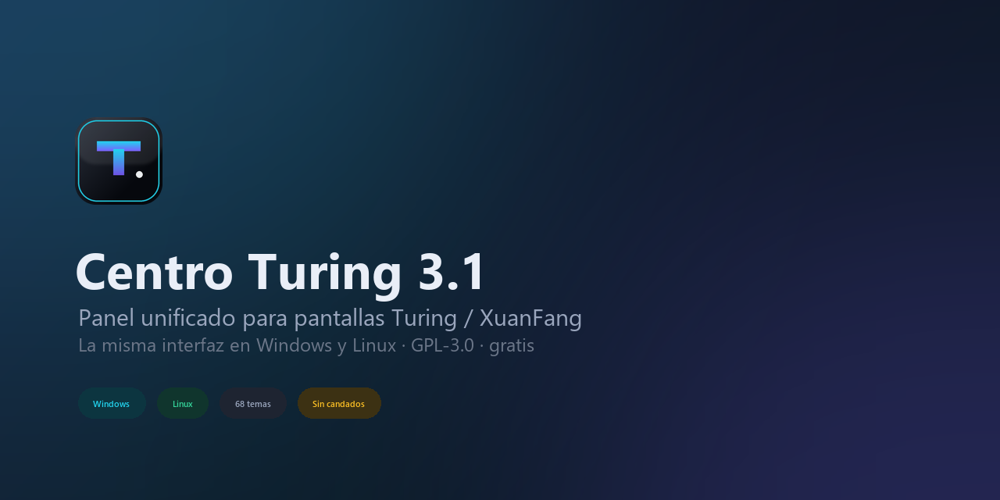

# Centro Turing

Panel de control y monitor para mini pantallas USB tipo **Turing Smart Screen /
XuanFang** (3.5", 5", 8.8"), en español, para **Windows y Linux**.

Esta es nuestra versión: parte del proyecto [turing-smart-screen-python](https://github.com/mathoudebine/turing-smart-screen-python)
(GPL-3.0) y se distribuye como **una sola aplicación**, el panel *Centro Turing*,
con nuestros temas, nuestros sensores y nuestros lanzadores. Créditos y licencia
completa en [CREDITOS.md](CREDITOS.md); lo que se ha dejado fuera, en
[docs/legado.md](docs/legado.md).



## Qué hay

| Pieza | Fichero | Para qué |
| --- | --- | --- |
| **Panel** | `Centro-Turing.cmd` · `dist\Centro-Turing-*.exe` · `./centro-turing.sh` | La app: estado, temas, brillo, ajustes, registro, sistema, acerca de |
| **Monitor** | `main.py` | Lo que se ve en la pantalla: CPU/GPU/RAM/disco/red/clima |
| **Encender** | `Iniciar.ps1` (Windows) · `./iniciar.sh` (Linux) | Arranca el monitor en segundo plano sin duplicar procesos |
| **Sensores reales** | `Iniciar-Admin.ps1` (Windows) | Pide UAC y usa LibreHardwareMonitor para temperaturas/ventiladores |
| **Instalar** | `Instalar.ps1` · `./iniciar.sh --install` | Crea el `venv` e instala las dependencias |
| **Paquete Linux** | `python tools/build_deb.py` | Genera un `.deb` que instala en `/opt/centro-turing` |
| **Panel en Python** | `python tools/turing_center.py` | Igual que el panel, sin compilar (`--status`, `--mockup`, `--selftest`) |

## Windows

```powershell
git clone https://github.com/pilahito/centro-turing
cd centro-turing

# 1) Dependencias (crea venv\ y config.yaml)
.\Instalar.ps1

# 2) Abrir el panel
.\Centro-Turing.cmd          # o doble clic en el .exe de dist\

# 3) Encender la pantalla (segundo plano)
.\Iniciar.ps1                # sensores basicos
.\Iniciar-Admin.ps1          # con temperaturas reales (pide UAC)
```

Comprueba el puerto serie si no aparece la pantalla:

```powershell
.\venv\Scripts\python.exe tools\list-serial-ports.py
```

## Linux (Ubuntu / Debian / Arch)

```bash
./iniciar.sh --install        # dependencias + venv
./centro-turing.sh            # panel grafico
./iniciar.sh                  # monitor de la pantalla
./iniciar.sh --autostart      # arranque automatico al iniciar sesion
```

Para el puerto USB hace falta el grupo `dialout`:

```bash
sudo usermod -aG dialout "$USER"   # y vuelve a iniciar sesion
```

Paquete `.deb`:

```bash
python3 tools/build_deb.py --version 3.1.0
sudo dpkg -i dist/centro-turing_3.1.0_all.deb
```

## El panel

Seis secciones, con la pantalla siempre a la vista:

- **Panel** — estado en vivo, vista previa del tema, control del monitor (encender / apagar / reiniciar), tema y brillo.
- **Temas** — los 68 temas instalados, con filtros por tamaño (3.5" H, 3.5" V, 5", 8.8") y búsqueda.
- **Ajustes** — puerto, revisión, sensores, idioma del clima, arranque automático.
- **Registro** — el `log.log` del monitor.
- **Sistema** — versión de Python, dependencias y hardware detectado.
- **Acerca de** — versión, licencia y créditos.

Sin ventana (útil para scripts y comprobaciones):

```bash
python tools/turing_center.py --status         # estado en texto
python tools/turing_center.py --theme ConilES  # aplica tema y arranca el monitor
python tools/turing_center.py --mockup         # rendea las 6 pantallas a tmp/mockups
python tools/turing_center.py --selftest       # construye la interfaz y valida el layout
```

## Temas

Van en `res/themes/<Nombre>/` (`theme.yaml` + `background.png` + `preview.png`).
`theme.yaml` define tamaño, orientación y cada dato (posición, fuente, color,
gráfica). Para crear uno: copia una carpeta, cambia el fondo y ajusta valores;
para verlo sin pantalla, `--mockup`.

## Sensores

- **Sin permisos**: `psutil` (CPU, RAM, disco, red) + clima por Open-Meteo (sin clave).
- **Con permisos de administrador**: LibreHardwareMonitor (`external/`) añade
  temperaturas de CPU/GPU, ventiladores y voltajes. Detalles en
  [docs/SENSORES-ES.md](docs/SENSORES-ES.md).

## Estructura

```
main.py                 monitor de la pantalla
library/                comunicacion serie y sensores
  lcd/                  protocolos de las pantallas (rev A/B/C/D, USB, WeAct)
  sensors/              psutil, LibreHardwareMonitor, personalizados
tools/
  turing_center.py      panel (punto de entrada de la app)
  turing_ui2026.py      interfaz 2026 (Pillow + Tkinter)
  turing_design.py      sistema de diseno (superficies, gradientes, tipografia)
  lanzar.py             arranque del monitor en Windows/Linux
  build_deb.py          empaquetado .deb
  list-serial-ports.py  diagnostico del puerto serie
res/
  themes/               temas incluidos
  fonts/                fuentes que usan los temas y la interfaz
  icons/                iconos de la app
external/               LibreHardwareMonitor y libusb (dependencias)
```

## Compilar el ejecutable (Windows)

```powershell
.\venv\Scripts\pyinstaller.exe --noconfirm centro-turing.spec
# -> dist\Centro-Turing-3.1.exe (icono propio, sin consola)
```

El `.exe` es el panel: busca el proyecto (su `main.py`) junto a él o en las rutas
habituales (`E:\centro-turing`, `/opt/centro-turing`).

## Licencia

GPL-3.0-or-later. Software libre, sin candados: puedes usarlo, estudiarlo,
modificarlo y redistribuirlo manteniendo la misma licencia y los créditos.
